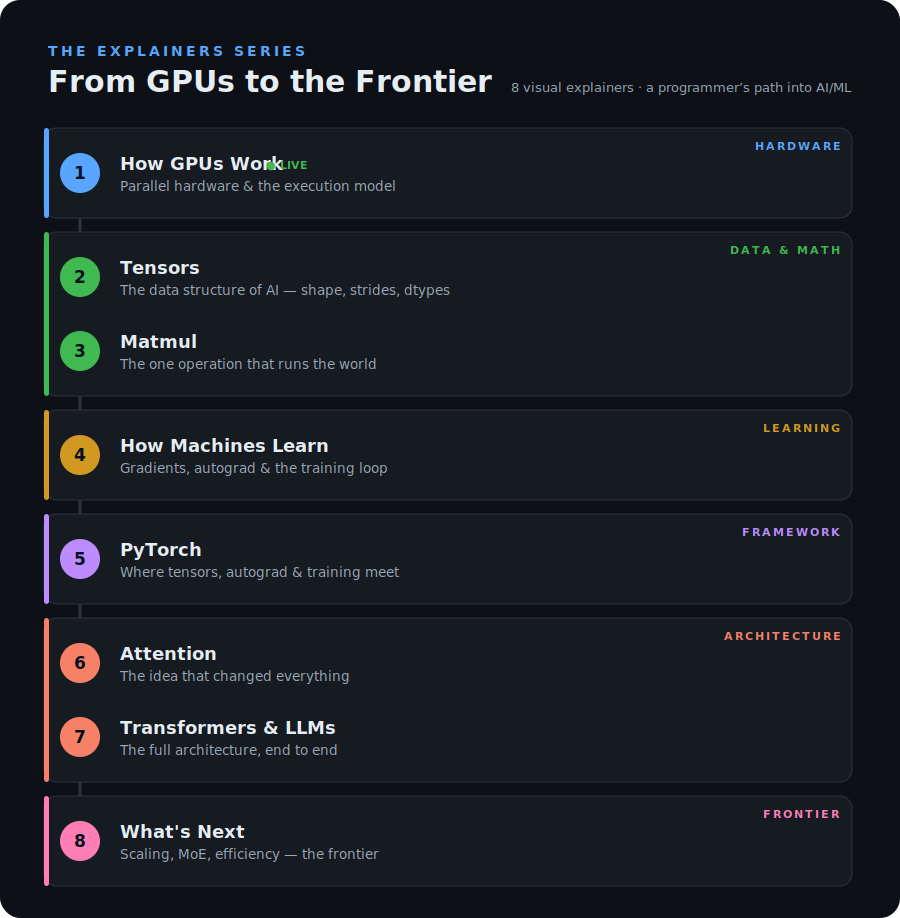

# From GPUs to the Frontier

*Part of [the Explainers project](../../README.md).*

Visual, interactive explainers that take a working programmer all the way from low-level GPU hardware to modern AI — one concept at a time, each one building on the last.

**🔗 Read this series live: https://esteevanderwalt.github.io/howstuffworks/content/gpu-to-frontier/**

I come from a programming background and I'm learning AI/ML in the open. These are the explainers I wish existed: they start from something you already understand (a `for` loop, an array, a function) and show the leap to the new idea — without dumbing down the technical detail.



## The roadmap

Each explainer ends by raising the exact question the next one answers, so the whole series reads as one continuous path.

| # | Explainer | What you'll understand | Status | Built on |
|---|-----------|------------------------|--------|----------|
| 1 | **How GPUs Work** | Parallel hardware & the execution model — why thousands of slow cores beat a few fast ones | ✅ Live | NVIDIA docs · Hwu et al. · Upadhyay |
| 2 | **Tensors** | The data structure of AI — shape, strides, dtypes, and how every op maps to a GPU kernel | 🔜 Planned | ezyang, *PyTorch internals* |
| 3 | **Matmul** | The one operation that runs the world — GEMM, tiling, tensor cores, memory- vs compute-bound | 🔜 Planned | Simon Boehm |
| 4 | **How Machines Learn** | Gradients, autograd & the training loop — the chain rule, made mechanical | 🔜 Planned | Karpathy, *micrograd* |
| 5 | **PyTorch** | Where tensors, autograd & training meet — the framework as the production version of 2–4 | 🔜 Planned | PyTorch docs, ezyang |
| 6 | **Attention** | The idea that changed everything — query/key/value, and why it's mostly matmuls | 🔜 Planned | Vaswani et al.; Jay Alammar |
| 7 | **Transformers & LLMs** | The full architecture, end to end — tokens, embeddings, blocks, inference | 🔜 Planned | Karpathy, *nanoGPT*; B. Bycroft |
| 8 | **What's Next** | Scaling laws, mixture-of-experts, efficiency, multimodal — the frontier | 🔜 Planned | (researched fresh) |

## How these are built

Every explainer is a **single, self-contained HTML file** — no build step, no dependencies, no framework. Open it in a browser, or host it free on GitHub Pages. That keeps each one portable (shareable as one file) and the series easy to maintain.

The shared look and structure live in [`template.html`](../../template.html): copy it, fill in the content, and you get the same styling, the "In plain words" callouts, the interactive shells, the searchable glossary drawer, and the credit block for free. The recipe for writing one is in [`STYLE.md`](../../STYLE.md).

## Folder structure

```
content/gpu-to-frontier/
├── index.html            ← this series' landing page
├── README.md             ← you are here (the series index)
├── linkedin-post.md      ← launch post draft for explainer #1
├── assets/
│   └── roadmap.svg       ← the series roadmap graphic
├── 01-how-gpus-work.html
└── 02-tensors.html       ← (future)
```

Shared, repo-wide files (`template.html`, `STYLE.md`, `LICENSE`, the top-level landing) live at the [repo root](../../).

## Reading them

- **Live:** https://esteevanderwalt.github.io/howstuffworks/content/gpu-to-frontier/
- **Locally:** open `index.html` (or any `NN-*.html` explainer) directly in your browser.
- **Hosting:** with GitHub Pages enabled on the repo, this series is served at `…/howstuffworks/content/gpu-to-frontier/`.

## Credit & sourcing

Each explainer is an **original synthesis grounded in primary sources** — every spec and concept is verified against canonical references (NVIDIA's official documentation, foundational textbooks, peer-reviewed papers), which are cited in full at the end of each piece. The writing, structure, diagrams, and interactives are my own.

This series also stands on the shoulders of excellent educators, and credits them generously. Where another explainer or talk inspired one of these, it's listed in that piece's "References & further reading" — **go read and support them**, they're worth your time.

For explainer #1, that includes [Abhinav Upadhyay's "What Every Developer Should Know About GPU Computing"](https://blog.codingconfessions.com/p/gpu-computing), alongside the NVIDIA CUDA C++ Programming Guide, the Hopper architecture documentation, and Hwu, Kirk & El Hajj's *Programming Massively Parallel Processors*.

## License

The explainer code and visualizations in this repo are released under the MIT License (see [`LICENSE`](../../LICENSE)). This does **not** cover the original articles, figures, or ideas they're based on — those belong to their respective authors and are used here under fair-use commentary/education. Always defer to the original sources for reuse of their material.

---

*Made by Estee · learning in public, one explainer at a time.*
